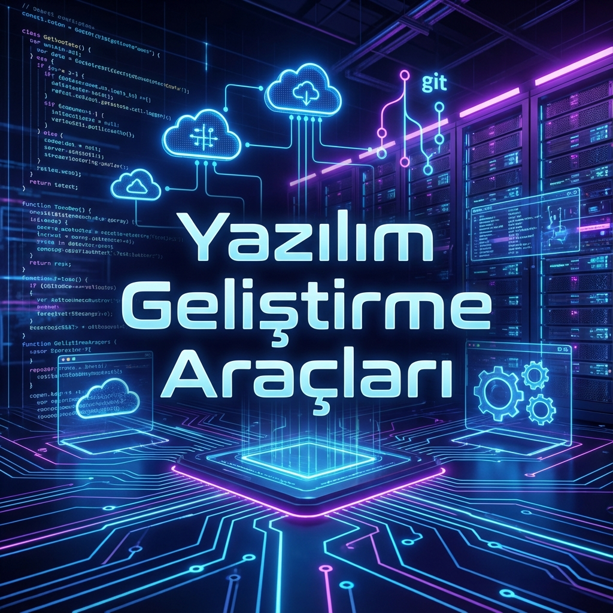

# 🚀 Yazılım Geliştirme Araçları ve Eğitim Materyalleri

**Modern yazılım geliştirme süreçlerine, araçlarına ve yapay zeka teknolojilerine dair kapsamlı rehberiniz.**

[Keşfetmeye Başla](#-i̇çindekiler) • [Katkıda Bulun](#-katkıda-bulunma) • [İletişim](#-geliştirici-hakkında)

---

## 📖 Proje Hakkında

Bu repo, yazılım dünyasına yeni adım atanlardan deneyimli geliştiricilere kadar herkes için bir kaynak kitap niteliğindedir. İki ana odak noktası vardır:
1.  **🛠️ Modern Geliştirme Araçları:** Kodun ilk satırından son kullanıcıya ulaşana kadar geçen süreçteki tüm araçların (Git, Docker, CI/CD) teorik ve pratik anlatımı.
2.  **🤖 Yeni Nesil Yapay Zeka:** Üretken yapay zeka araçlarının (GenAI), prompt mühendisliğinin ve AI destekli iş akışlarının keşfi.

---

## 📁 İçerik Haritası

| Klasör | Açıklama |
| :--- | :--- |
| `gelistirme-araclari/` | IDE, Git, Docker, Jira gibi temel araçlar için mini rehberler. |
| `ornek-proje/` | Öğrenilen araçların uygulandığı Full-stack Todo uygulaması. |
| `uretken-yapay-zeka/` | GenAI araçları ve kullanım senaryoları. |
| `prompt-engineering/` | Prompt mühendisliği labları ve şablonları. |
| `deepseek/` | **[YENİ]** DeepSeek açık kaynak kodlama modelleri. |
| `gamma-app/` | **[YENİ]** AI ile saniyeler içinde sunum hazırlama. |
| `canva-magic-design/` | **[YENİ]** Tasarım süreçlerinde yapay zeka devrimi. |
| `perplexity/` | **[YENİ]** Gerçek zamanlı yapay zeka arama motoru. |
| `poe/` | **[YENİ]** Tüm yapay zeka modellerine tek noktadan erişim. |
| `stable-diffusion/` | **[YENİ]** Açık kaynak metinden görsel üretme (Text-to-Image). |
| `notebookLM/` | Google'ın yapay zeka destekli not defteri rehberi. |

---

## 📑 İçindekiler

*   [1. Giriş ve Amaç](#1-giriş-ve-amaç)
*   [2. Yazılım Geliştirme Yaşam Döngüsü (SDLC)](#2-yazılım-geliştirme-yaşam-döngüsü-sdlc)
*   [3. Araçlar ve Teknolojiler](#3-araçlar-ve-teknolojiler)
    *   [3.1 IDE & Editörler](#31-ide--editörler)
    *   [3.2 Versiyon Kontrolü](#32-versiyon-kontrolü)
    *   [3.3 Otomasyon & CI/CD](#33-otomasyon--cicd)
*   [4. Yapay Zeka Ekosistemi](#4-yapay-zeka-ekosistemi)
*   [5. Pratik Uygulama: Todo App](#5-pratik-uygulama-todo-app)
*   [6. Geliştirici Hakkında](#-geliştirici-hakkında)

---

## 1. Giriş ve Amaç

Yazılım sadece kod yazmaktan ibaret değildir; doğru araçları, doğru zamanda ve uyum içinde kullanma sanatıdır. Bu materyal, **verimliliği artırmak**, **hataları minimize etmek** ve **global standartlarda** iş üretmek isteyenler için hazırlanmıştır.

## 2. Yazılım Geliştirme Yaşam Döngüsü (SDLC)

Modern bir proje şu evrelerden geçer ve her evrenin kendi şövalyeleri (araçları) vardır:

1.  **Analiz** 📝 (Jira, Trello)
2.  **Tasarım** 🎨 (Figma, Canva)
3.  **Geliştirme** 💻 (VS Code, Copilot)
4.  **Test** 🧪 (Selenium, Jest)
5.  **Dağıtım** 🚀 (Docker, Kubernetes)
6.  **Bakım** 🔧 (Sentry, Dependabot)

---

## 3. Araçlar ve Teknolojiler

### 3.1. IDE & Editörler
Kodun evi.
*   **VS Code:** Eklenti okyanusu ile sektör standardı.
*   **IntelliJ / PyCharm:** Akıllı kod analizi için vazgeçilmezler.

### 3.2. Versiyon Kontrolü
Zaman makineniz.
*   **Git:** Değişikliklerin efendisi.
*   **GitHub:** Kodların sosyal ağı ve bulut evi.

### 3.3. Otomasyon & CI/CD
Robotlarınız iş başında.
*   **GitHub Actions:** Her `git push` ile çalışan otomatik test ve dağıtım senaryoları.
*   **Docker:** "Benim bilgisayarımda çalışıyordu" bahanesinin sonu.

---

## 4. Yapay Zeka Ekosistemi

Gelecek şimdi.
*   **DeepSeek:** Açık kaynak kodlama ve dil modelleri.
*   **Perplexity:** İnternet erişimli, kaynak gösteren cevap motoru.
*   **Poe:** GPT-4, Claude 3 ve daha fazlasına tek arayüzden ulaşın.
*   **Stable Diffusion:** Kendi bilgisayarınızda sınırsız görsel üretin.
*   **Gamma App:** Sadece metin girerek profesyonel sunumlar oluşturun.
*   **Canva Magic Design:** Tasarım bilmeden profesyonel görseller üretin.
*   **NotebookLM:** Kaynaklarınızla sohbet edin, öğrenmeyi hızlandırın.

---

## 5. Pratik Uygulama: Todo App

Teori yetmez, pratik şart. `ornek-proje/` klasörü altında çalışan bir **Todo Uygulaması** bulacaksınız. Bu proje şunları içerir:
*   ✅ Node.js Backend
*   ✅ Birim Testler
*   ✅ Dockerfile Konfigürasyonu
*   ✅ CI/CD Pipeline Tanımı

---

## 👨‍💻 Geliştirici Hakkında

**Bahattin Yunus Çetin**  
*IT Architect & Üniversite Öğrencisi*

### 🚀 Profesyonel Vizyon
Bahattin Yunus Çetin, modern yazılım mimarileri ve dijital dönüşüm süreçleri üzerine uzmanlaşan vizyoner bir IT Architect adayıdır. Teknolojiyi sadece bir araç olarak değil, karmaşık sorunlara çözüm üreten stratejik bir güç olarak ele almaktadır. Ölçeklenebilir, güvenli ve performans odaklı sistemler tasarlama konusundaki tutkusu, onu sürekli araştırmaya, öğrenmeye ve sınırları zorlamaya itmektedir.

### 🎓 Akademik Geçmiş
Eğitim hayatına Trabzon'un köklü ve kültürel zenginlikleriyle bilinen **Of** ilçesinde devam etmektedir. Üniversite eğitimi süresince edindiği güçlü teorik altyapıyı, gerçek dünya projeleriyle harmanlayarak sağlam bir teknik temel inşa etmiştir. Akademik disiplini, profesyonel iş etiğiyle birleştirerek, bulunduğu coğrafyanın azmini ve kararlılığını projelerine yansıtmaktadır.

### 🛠️ Teknik Odak ve Uzmanlık
Bulut bilişim, yapay zeka entegrasyonları ve DevOps kültürünün benimsenmesi, teknik yetkinliklerinin merkezinde yer alır. Özellikle **DeepSeek** ve **Gamma** gibi yeni nesil üretken yapay zeka araçlarının yazılım geliştirme döngüsüne (SDLC) entegrasyonu konusunda yenilikçi çalışmalar yürütmektedir. Amacı, geliştirme süreçlerini optimize etmek ve otomasyonla verimliliği maksimize eden sürdürülebilir mimariler kurmaktır.

### 🎯 Misyon
Sürdürülebilir, yenilikçi ve insan odaklı teknolojik çözümler üretmeyi kendine misyon edinmiştir. Açık kaynak dünyasına katkıda bulunmak, bilgi paylaşımıyla teknoloji topluluğuna değer katmak ve geleceğin dijital altyapılarını bugünden tasarlamak, kariyer yolculuğunun en önemli motivasyon kaynaklarındandır.

---

## 🤝 Katkıda Bulunma

Bu proje açık kaynaklıdır ve topluluk katkılarına açıktır.  
Bir hata mı buldunuz? Yeni bir araç mı eklemek istiyorsunuz?  
Hemen bir **Pull Request** gönderin veya **Issue** açın!

**Lisans:** [MIT](LICENSE)

